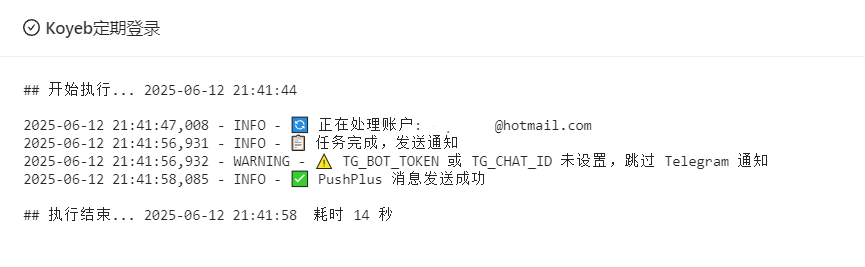

Koyeb Auto Login
🧩 项目简介
Koyeb Auto Login 是一个自动化脚本，旨在定期登录 Koyeb 账户，以保持账户的活跃状态，避免因长时间未使用而被系统停用。脚本基于 青龙面板 部署，可设置 Telegram 或 PushPlus 通知。

## 🚀 部署方式（适用于青龙面板）
### 1️⃣ 设置环境变量
在青龙面板中依次添加以下环境变量：

| Secret 名称        | 说明                                         | 是否必须 |
| ---------------- | ------------------------------------------ | ---- |
| `KOYEB_ACCOUNTS` | 存储 Koyeb 账户信息（JSON 格式）                     | ✅ 必须 |
| `TG_BOT_TOKEN`   | Telegram Bot 的 Token                       | ❌ 可选 |
| `TG_CHAT_ID`     | Telegram 账号的 Chat ID                       | ❌ 可选 |
| `PUSHPLUS_TOKEN` | [PushPlus](https://pushplus.plus/) 的 Token | ❌ 可选 |

✅ 只设置 KOYEB_ACCOUNTS 也能运行，但建议至少配置 PUSHPLUS_TOKEN 或 TG_BOT_TOKEN + TG_CHAT_ID，否则没有任何通知提醒。
   
📦 KOYEB_ACCOUNTS 变量示例：
   
   ```json
   [
     {
       "email": "your-email@example.com",
       "password": "your-password"
     },
     {
       "email": "another-email@example.com",
       "password": "another-password"
     }
   ]
   ```

### 2️⃣ 添加脚本文件

进入青龙面板 ➜ 脚本管理，新建脚本（如 koyeb.py），复制本项目的 koyeb.py 脚本内容粘贴保存。

### 3️⃣ 添加定时任务
进入青龙面板 ➜ 定时任务 ➜ 新建任务，设置如下：

| 字段   | 示例内容                                    |
| ---- | --------------------------------------- |
| 名称   | `Koyeb 定期登录`                            |
| 命令   | `task koyeb.py`                         |
| 定时规则 | `18 12 3,17 * *`（每月的 3 日和 17 日中午 12:18） |




## 免责声明

本项目仅用于个人学习和研究，使用者需自行承担使用风险。

